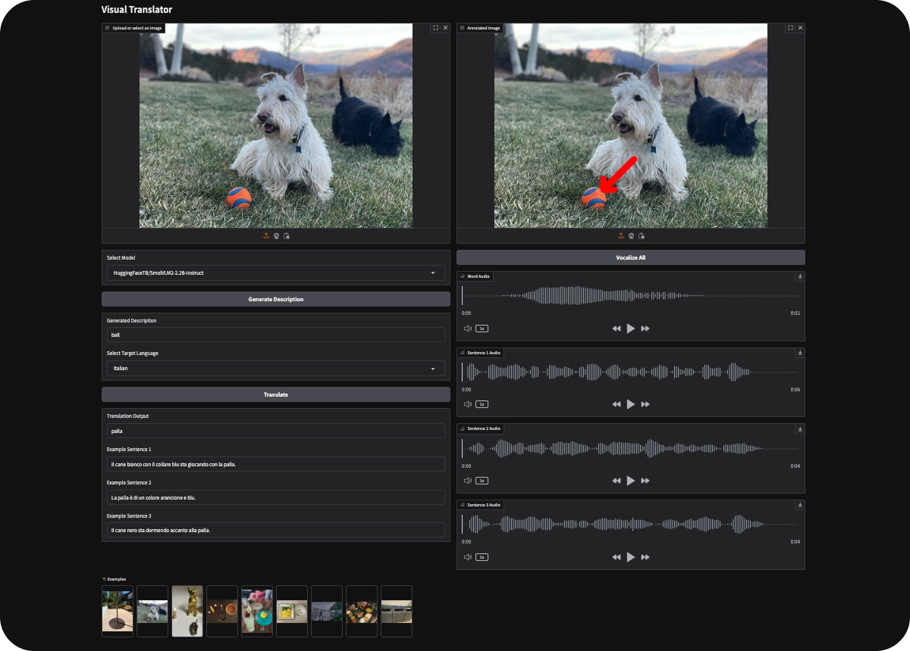

# Visual Translator 🖼️📣

Welcome to the **Visual Translator**! This project was developed during the **Entrepreneur First Hackathon 2025** in Zurich🇨🇭.
The goal was to create a translation companion that enhances the way people interact with their environment, enabling them to translate objects they can see and capture in real time.

By simply loading an image and clicking on the object you want to observe and translate, you’ll receive not only the translation but also three sample sentences in the target language, coherent with the context of the image.

## Demo

The models can be accessed through an intuitive Gradio interface. Launch the application and start translating effortlessly!



## 🚀 Features

- **Upload or Select Images**: Choose an image from your computer, camera, or use one of the default examples to get started.
- **Click to Annotate**: Click on the object you want to translate, and the system will annotate the image with an arrow.
- **Model Selection**: Choose from two vision-language models, SmolVLM2 and PaliGemma 2 mix.
- **Translation and Descriptions**: Receive the translation of the object and three sample sentences coherent with the context. Uses Llama-3.2 version.
- **Text to Audio**: Hear how to pronounce the word and the sentences in the target language, powered by ElevenLabs.
- **Gradio Interface**: A user-friendly interface that makes it easy to interact with the tool.

## 🛠 Installation

1. **Clone the repository**:

 ```bash
git clone https://github.com/massimilianoviola/visual-translator.git
 ```

2. **Install the dependencies** (a Python virtual environment is recommended, e.g. conda):

 ```bash
pip install -r requirements.txt
 ```

3. **Run the demo** (an ElevenLabs API key is required):

 ```bash
ELEVENLABS_API_KEY=YOUR_API_KEY python gradio_demo.py
 ```

## 🌍 Usage

1. Upload an image or choose one from the example options.
2. Click on the image to place an arrow on the object you wish to translate.
3. Select the vision-language model you prefer.
4. Click the "Generate Description" button to get the translated term.
5. Select the target language, among the ones supported by Llama-3.2.
6. Click the "Translate" button to get the translation of the object and the three sample sentences.
7. Click the "Vocalize All" button to get the audio of the translation and sample sentences.

## 🤝 Team Members

This project is brought to you by the talented team members participating in the **Entrepreneur First Hackathon 2025**, Zurich:

- **Massimiliano Viola**
- **You Wu**
- **Timur Taepov**

## 🔑 Notes

- This demo uses two pre-trained VLM models: **SmolVLM2** and **PaliGemma 2 mix**. It also uses **Llama-3.2** for translation and sentence generation. Make sure you have access to these models from Hugging Face and load an HF access token via cli.
- Ensure that your ElevenLabs API key is passed as an environment variable to the demo or set as the global variable ELEVENLABS_API_KEY.
